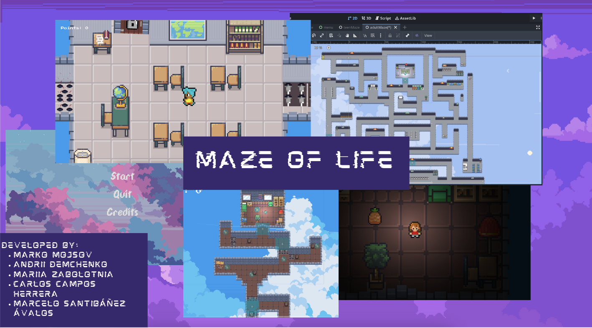

# Description

"Maze of Life" is a game developed within the hackathon organized by Skip, Chalmers University, and Gothenburg University. Each team had 48 hours to develop a game based on the theme "Whisper of Change." The game is available at the link: https://itch.io/jam/march-game-jam-2024

Maze of Life is a philosophical journey where you guide a character through the intricate mazes of existence. As you navigate through the corridors of different stages of your life, you'll confront the complexities of growth, change, and transformation.
Each maze represents a stage of life and challenges that get progressively harder in reflection of the human experience.

## Demo

## Developed by:

- Marko Mojsov  
- Andrii Demchenko
- Mariia Zabolotnia
- Carlos Campos Herrera
- Marcelo Santibáñez Ávalos

# Credits

## Textures

- Decoration stuff:
  - https://o-lobster.itch.io/simple-dungeon-crawler-16x16-pixel-pack
  - https://opengameart.org/content/isaiah658s-pixel-pack-2
  - https://limezu.itch.io/moderninteriors
- Sky stuff:
  - https://free-game-assets.itch.io/free-sky-with-clouds-background-pixel-art-set

## Music

- Playlist: https://www.youtube.com/playlist?list=PLRPR8uJQx5tHZXO06KtUrdMhbeKiPwDoM
